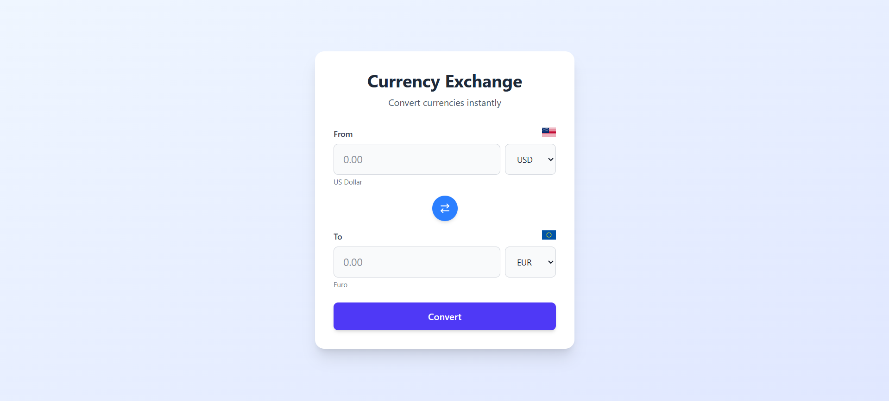
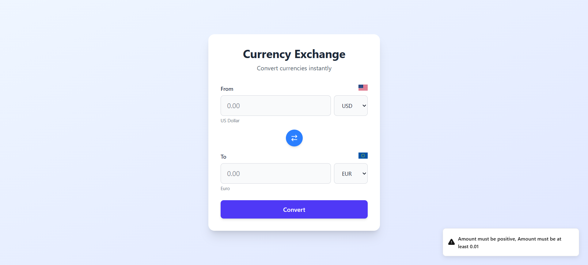
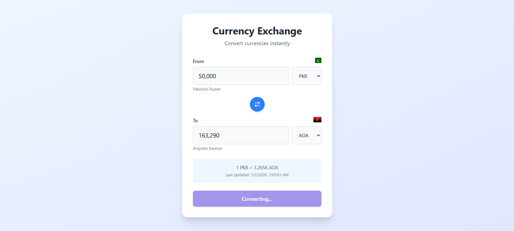
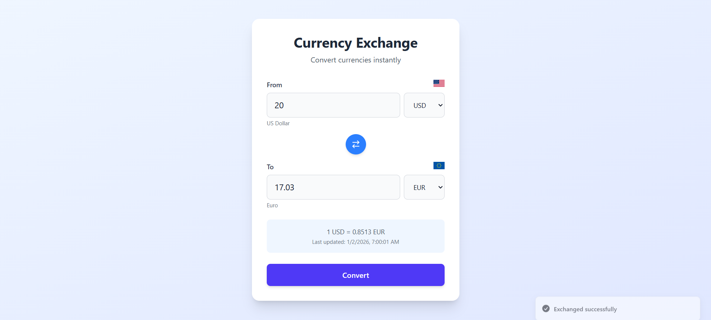

My solution to the problem 2: <strong>Fancy form</strong>

# Demo

<details open>
<summary><strong>UI Overview</strong></summary>
<br />

</details>

<details>
<summary><strong>Input Validation</strong></summary>
<br />

</details>

<details>
<summary><strong>Converting State</strong></summary>
<br />

</details>

<details>
<summary><strong>Happy Case</strong></summary>
<br />

</details>

## Setup Guide

### Prerequisites

- Node.js (v16 or higher)
- npm or yarn package manager

### Installation Steps

1. **Clone the repository**

   ```bash
   git clone https://github.com/QuangNV23062004/Nguyen_Vinh_Quang.git
   ```

2. **Navigate to the project directory**

   ```bash
   cd Nguyen_Vinh_Quang/src/problem2
   ```

3. **Install dependencies**

   ```bash
   npm install
   ```

4. **Configure environment variables**

   - Obtain an API key from [ExchangeRate-API](https://www.exchangerate-api.com/) (this is free)
   - Create a `.env` file in the project root
   - Add your API key:
     ```
     VITE_EXCHANGE_RATE_API_KEY=your_api_key_here
     ```

5. **Start the development server**

   ```bash
   npm run dev
   ```

6. **Open your browser**
   - Navigate to the URL displayed in the terminal (typically `http://localhost:5173`)

### Additional Commands

- **Build for production**: `npm run build`
- **Preview production build**: `npm run preview`
- **Run linter**: `npm run lint` (if configured)

## Extra Notes:

- Flags from currency are taken from external libraries, sometime they might not display correctly
- I've choose to use an external service api key for exchange rate for newer exchange rate.
- The selected external service also provide built-in exchange rate conversion when 2 currency are selected.
- This project use react vite with typescript.
- The app is setup is very minimal.
