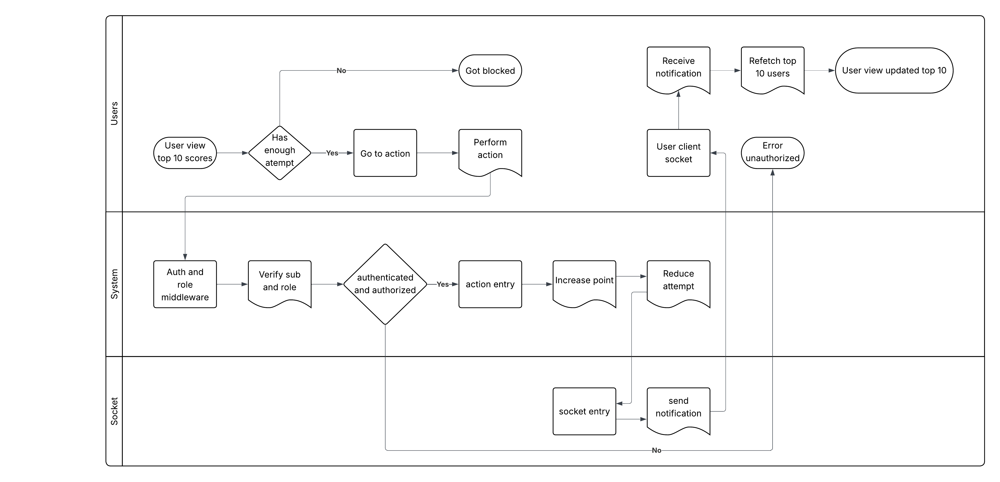

# Software Module Specification

## 1. Overview

- This is software module specification for the live update of the top 10 users in the scoreboards.
- The purpose of this document is to specify the requirements, provide and explain my approach to the module.

## 2. Responsibility

- The module will allow users to get top 10 users' score.
- The module will allow users to view live update of the scores in realtime.
- The module will handle the update score from users based on actions(which is not specified).
- Upon completing the action, an API call will be dispatched to perform score update.
- The module will only increase scores for allowed users, with proper authentications and authorization.

## 3. Api Design

#### 3.1. End points:

##### 3.1.1 Users:

- Manages all users end points,
- Allow CRUD action for user with appropriate role or access based on RBAC

##### 3.1.2 Actions:

- Manages all actions related end points, including CRUD for administrator.
- Handling point increase from user end points.
- Send notification for frontend to refetch top 10

##### 3.1.3 Auth:

- Handling registration, authentication and authorization for users.
- Mostly are public API, except for renew refresh-token which requires users to provide their valid refresh-token in cookies or authorization header.

#### 3.2. Request/Response:

##### 3.2.1 GET: /users?page=1&limit=10&order=desc&orderBy=score

**Description:** Retrieve the top 10 users ordered by score

**Query Parameters:**

- `page=1` - Page number (1-indexed)
- `limit=10` - Number of results per page
- `orderBy=score` - Field to sort by (default: score)
- `order=desc` - Sort direction: `asc` or `desc` (default: desc)

**Response (200 OK):**

```json
{
  "data": [
    {
      "id": "user-1",
      "email": "user1@example.com",
      "currentScore": 5000,
      "rank": 1
    }
  ],
  "pagination": {
    "page": 1,
    "limit": 10,
    "total": 100
  }
}
```

**Error Responses:**

- `400 Bad Request` - Invalid query parameters
- `401 Unauthorized` - Missing/invalid token (if endpoint becomes protected)

##### 3.2.2 POST: /actions/increase-point

**Description:** Protected endpoint to increase a user's score upon completing an action

**Request Body:**

```json
{
  "type": "daily_bonus",
  "metadata": {}
}
```

**Response (201 Created):**

```json
{
  "action": {
    "id": "action-123",
    "userId": "user-1",
    "type": "daily_bonus",
    "pointsEarned": 100,
    "timestamp": "2026-01-03T10:30:00Z"
  },
  "userScore": {
    "currentScore": 5100,
    "attemptsRemaining": 4
  }
}
```

**Error Responses:**

- `400 Bad Request` - Invalid action type
- `401 Unauthorized` - Missing/invalid token
- `403 Forbidden` - Insufficient attempts remaining, action not allowed
- `429 Too Many Requests` - Rate limit exceeded
- `500 Internal Server Error` - Score update failed (transaction rollback)

**Key Details:**

- Only users with valid access-token can perform this action
- Backend validates action type and retrieves point value from database
- Attempts counter is decremented after successful score update
- All requests must be validated through auth and role middleware
- Transaction must ensure atomicity: score update and attempt decrement succeed together

##### 3.2.3 POST: /auth/register

**Description:** Create a new user account

**Request Body:**

```json
{
  "email": "user@example.com",
  "password": "securePassword123",
  "username": "user123"
}
```

**Response (201 Created):**

```json
{
  "id": "user-1",
  "email": "user@example.com",
  "username": "user123",
  "createdAt": "2026-01-03T10:00:00Z"
}
```

**Error Responses:**

- `400 Bad Request` - Invalid email/password format
- `409 Conflict` - Email already registered
- `422 Unprocessable Entity` - Password does not meet requirements

##### 3.2.4 POST: /auth/login

**Description:** Authenticate user and return JWT tokens

**Request Body:**

```json
{
  "email": "user@example.com",
  "password": "securePassword123"
}
```

**Response (200 OK):**

```json
{
  "accessToken": "eyJhbGc...",
  "refreshToken": "eyJhbGc...",
  "user": {
    "id": "user-1",
    "email": "user@example.com",
    "role": "user"
  }
}
```

**Details:**

- User provides email and password in request body
- System retrieves user by email and compares password with bcrypt hash
- Access token (15-30 min expiry) contains: `{ sub, role, iat, exp }`
- Refresh token (7 days expiry) is stored in HTTP-only cookie
- Returns 401 if credentials are invalid

**Error Responses:**

- `401 Unauthorized` - Invalid email or password

##### 3.2.5 POST: /auth/refresh-token

**Description:** Renew access token using refresh token

**Request:**

- Refresh token must be in HTTP-only cookie or Authorization header

**Response (200 OK):**

```json
{
  "accessToken": "eyJhbGc...",
  "expiresIn": 1800
}
```

**Error Responses:**

- `401 Unauthorized` - Invalid or expired refresh token
- `403 Forbidden` - Refresh token has been revoked

##### 3.2.6 POST: /auth/logout

**Description:** Invalidate refresh token and end session

**Response (204 No Content):**

- Refresh token is added to revocation list
- Cookie is cleared

##### 3.2.7 GET: /action-types

**Description:** Retrieve all available action types and their point values

**Response (200 OK):**

```json
{
  "actionTypes": [
    {
      "type": "daily_bonus",
      "value": 100,
      "maxAttemptsPerDay": 5,
      "description": "Daily login bonus"
    },
    {
      "type": "quest_complete",
      "value": 250,
      "maxAttemptsPerDay": 3,
      "description": "Complete a quest"
    }
  ]
}
```

**Note:** This endpoint may be public or protected depending on design choice

3. <strong>Auth Requirements:</strong>

#### 3.3 Auth middleware/guard:

- Intercept the request, extract the accessToken from either cookie or `Authorization: Bearer <token>` header
- Verify the jwt token signature and expiration based on the secret in environment/config
- Decode token and extract `sub` (user ID) and `role` (if present)
- Set decoded user information into request context/state for lower layers to access
- Return error `401 Unauthorized` with message if token is missing, invalid, or expired
- Accept requests without token for public endpoints (login, register, public leaderboard)

#### 3.4 Role middleware:

- Receive array of allowed roles as parameter in route configuration
- Access the role set by auth middleware in request context
- If role not set in claims, retrieve user by `sub` to get the user's role from database
- Verify if the retrieved role exists in the allowed roles array
- Return error `403 Forbidden` if user's role is not in the allowed list
- Set role in request context if not already set
- Handle case where user is not found (return `401 Unauthorized`)

#### 3.5 Token Security:

- **Access Token**:

  - Expiration: 15-30 minutes (configurable)
  - Payload: `{ sub: userId, role: userRole, iat: issuedAt, exp: expiration }`
  - Signed with HS256 or RS256 algorithm
  - Stored in memory or httpOnly cookie (not in localStorage)

- **Refresh Token**:

  - Expiration: 7 days (configurable)
  - Stored in httpOnly, Secure, SameSite cookie
  - Stored in database with `isRevoked` flag for invalidation
  - Token rotation: optional new refresh token on each renewal

- **Password Security**:
  - Hashed with bcrypt (cost factor: 10-12)
  - Never transmitted or logged
  - Minimum requirements: 8 chars, 1 uppercase, 1 digit, 1 special char

## 4. Execution flow

#### 4.1. Flow diagram:

   

#### 4.2. Description

The diagram illustrates the interaction between Users, the Backend System, and the Socket layer during score updates and live leaderboard synchronization.

##### 4.2.1 User Flow

- Users initially view the Top 10 scores on the scoreboard.

- When a user attempts to perform a score-affecting action, the client checks whether the user has remaining allowed attempts.

- If the user does not have sufficient attempts, the request is rejected and the user is blocked from performing the action.

- If the user is allowed, they proceed to perform the action.

- The user client maintains a socket connection to receive real-time updates.

- Upon receiving a notification, the client refetches the Top 10 users and updates the scoreboard view accordingly.

##### 4.2.2 Backend System Flow

- Action requests are received by the backend and pass through authentication and role-based authorization middleware.

- The system verifies the user’s identity (subject) and assigned role before processing the request.

- A valid action is recorded as an action entry.

- The backend increments the user’s score based on the completed action.

- Internal anti-abuse counters, such as remaining attempts, are updated after the score change.

##### 4.2.3 Socket / Real-Time Update Flow

- After a successful score update, the backend creates a socket event entry.

- A notification is sent to all connected clients through the socket layer.

- Clients listening on the socket receive the update event and synchronize their leaderboard state with the latest data.

##### 4.2.4 Failure and Blocking Scenarios

- If authentication, authorization, or attempt validation fails at any stage, the action is rejected.

- In blocked scenarios, no score update is performed and no socket notification is emitted.

##### 4.2.5 Notes

- The “attempt” and blocking logic shown in the diagram represents an optional anti-abuse mechanism and is not a mandatory business requirement.

- The specific nature of the user action that increases the score is out of scope for this module.

- The socket layer may be implemented using WebSockets, SSE, or an equivalent real-time messaging mechanism.

## 5. Live Update Mechanism

#### 5.1 WebSocket Implementation

- Live updates use WebSocket to establish persistent connection between server and client
- Client connects to `/socket.io` or `/ws` endpoint with authentication token
- Connection lifecycle:
  1. Client initiates connection with access token
  2. Server validates token and establishes connection
  3. Server adds client to broadcast list
  4. Server sends current leaderboard state to newly connected client
  5. Client receives real-time updates while connected
  6. On disconnect, server removes client from broadcast list

#### 5.2 Socket Events

**Server → Client Events:**

- **`leaderboard:update`** - New top 10 leaderboard after score change

  ```json
  {
    "event": "leaderboard:update",
    "data": {
      "users": [...],
      "changedUserId": "user-1",
      "timestamp": "2026-01-03T10:30:00Z"
    }
  }
  ```

- **`score:updated`** - Specific score update notification

  ```json
  {
    "event": "score:updated",
    "data": {
      "userId": "user-1",
      "previousScore": 5000,
      "newScore": 5100,
      "actionType": "daily_bonus",
      "pointsEarned": 100
    }
  }
  ```

- **`connection:established`** - Connection confirmation with current state
  ```json
  {
    "event": "connection:established",
    "data": {
      "leaderboard": [...],
      "clientId": "unique-client-id"
    }
  }
  ```

**Client → Server Events:**

- **`leaderboard:subscribe`** - Subscribe to updates

  ```json
  {
    "event": "leaderboard:subscribe"
  }
  ```

- **`leaderboard:unsubscribe`** - Unsubscribe from updates

#### 5.3 Update Trigger Flow

1. User completes action → POST `/actions/increase-point`
2. Backend validates and updates database (atomic transaction)
3. Backend emits socket event to all connected clients
4. Clients receive notification and can:
   - Refetch top 10 via API
   - Directly update UI from socket payload
5. Real-time sync ensures all clients see consistent leaderboard state

#### 5.4 Connection Management

- **Heartbeat/Keep-Alive**: Server sends ping every 30 seconds, client responds with pong
- **Reconnection**: Client auto-reconnects with exponential backoff (1s, 2s, 4s, max 30s)
- **Timeout**: Server closes connection if no activity for 5 minutes
- **Authentication**: Re-validate token on reconnect

## 6. Security & Abuse Prevention

#### 6.1 Authentication & Encryption

- **Password Storage**: Bcrypt with cost factor 10-12 (not plaintext, never logs)
- **Token Structure**:
  - Access Token: Short-lived (15-30 min), stored in memory/httpOnly cookie
  - Refresh Token: Long-lived (7 days), stored in secure httpOnly cookie, tracked in database
- **HTTPS Only**: All endpoints must use HTTPS in production
- **Token Revocation**: Refresh tokens tracked in database with `isRevoked` flag
- **CORS**: Restrict to known frontend domain(s) with credential support

#### 6.2 API Protection

- **Protected Actions Endpoint**: All score-modifying actions require valid access token
- **Role-Based Access Control (RBAC)**:
  - Users can only increase their own score (verified via `sub` in token)
  - Admins can perform admin actions (manage action types, view analytics)
  - Different user roles can have different action type access
- **Request Validation**:
  - Validate all input parameters (action type, amounts)
  - Reject requests with invalid/suspicious payloads
  - Implement input sanitization

#### 6.3 Abuse Prevention - Rate Limiting

**Approach 1: Attempt-Based Rate Limiting (Recommended)**

- Each action type has `maxAttemptsPerDay` stored in database
- User has `attemptsRemaining` counter in `UserScore` table
- Counter resets daily at configurable time (UTC midnight)
- Prevents unlimited score inflation regardless of effort

**Approach 2: Time-Based Rate Limiting**

- Implement per-user request rate limiting: e.g., 10 requests per 60 seconds
- Use token bucket or sliding window algorithm
- Reject with `429 Too Many Requests` when exceeded

**Approach 3: Cost-Based Rate Limiting**

- Combine both: attempts + time-based limiting
- More robust against API abuse

#### 6.4 Data Validation

- **Action Information**: Stored entirely in database, never exposed to client
- **Backend-Only Calculation**: Point values calculated server-side
- **Type Verification**: Validate action type against database before processing
- **Amount Validation**: Ensure points from database match expectations
- **No Client Trust**: Never trust action type or point value from client

#### 6.5 Database Security

- **Transactions**: Score updates must be atomic
  - Increment score
  - Decrement attempts
  - Record action entry
  - All succeed or all rollback (no partial updates)
- **Parameterized Queries**: Prevent SQL injection
- **Connection**: Use connection pooling, TLS for database connections
- **Backups**: Regular encrypted backups with tested restore procedures

#### 6.6 Monitoring & Logging

- **Audit Trail**: Log all score-affecting actions with user ID, action type, timestamp
- **Failed Attempts**: Log authentication/authorization failures
- **Suspicious Activity**: Alert on anomalies (e.g., 100 requests in 1 minute)
- **Log Rotation**: Implement log rotation and secure storage (never in code)

## 7. Data Model

The following data models define the minimum schema required for the scoreboard service.  
Field names and types are illustrative and may be adjusted based on the selected database.

#### 7.1 User

Represents an authenticated user in the system.

```ts
User {
  id: string (UUID)
  email: string (unique, indexed)
  username: string (unique, optional)
  passwordHash: string (bcrypt hash)
  role: enum ('user', 'admin', 'moderator') // default: 'user'
  isVerified: boolean (default: false)
  isActive: boolean (default: true)
  createdAt: timestamp (UTC)
  updatedAt: timestamp (UTC)
  lastLoginAt: timestamp (nullable, UTC)
}
```

#### 7.2 UserScore

Tracks user's current score and action attempts.

```ts
UserScore {
  id: string (UUID)
  userId: string (foreign key to User)
  currentScore: number (default: 0, minimum: 0)
  attemptsRemaining: number (sum of all action type limits)
  totalActionsPerformed: number (for analytics)
  lastActionAt: timestamp (nullable, UTC)
  dailyAttemptsResetAt: timestamp (UTC)
  createdAt: timestamp (UTC)
  updatedAt: timestamp (UTC)

  Indexes: userId (unique), userId + createdAt
}
```

#### 7.3 ActionType

Defines available actions and their point values.

```ts
ActionType {
  id: string (UUID)
  type: string (unique, indexed) // 'daily_bonus', 'quest_complete', etc.
  value: number (points awarded, must be >= 0)
  maxAttemptsPerDay: number (default: 1)
  description: string
  isActive: boolean (default: true)
  createdAt: timestamp (UTC)
  updatedAt: timestamp (UTC)

  Indexes: type
}
```

#### 7.4 UserAction

Audit trail of all actions performed by users.

```ts
UserAction {
  id: string (UUID)
  userId: string (foreign key to User)
  actionType: string (foreign key to ActionType.type)
  pointsEarned: number
  metadata: JSON (optional, action-specific data)
  ipAddress: string (for fraud detection)
  createdAt: timestamp (UTC)

  Indexes: userId, userId + createdAt, actionType, createdAt
}
```

#### 7.5 RefreshToken

Tracks refresh tokens for invalidation.

```ts
RefreshToken {
  id: string (UUID)
  userId: string (foreign key to User)
  token: string (hashed refresh token, indexed)
  isRevoked: boolean (default: false)
  expiresAt: timestamp (UTC)
  createdAt: timestamp (UTC)

  Indexes: token (unique), userId, expiresAt
}
```

#### 7.6 DailyAttemptReset (Optional)

Tracks daily reset schedule for attempts (if not stored in UserScore).

```ts
DailyAttemptReset {
  id: string (UUID)
  userId: string (foreign key to User)
  resetDate: date
  attemptsCounted: object (JSON, action type → count used)
  createdAt: timestamp (UTC)

  Indexes: userId + resetDate (unique)
}
```

**Notes:**

- All timestamps should be UTC with timezone awareness
- Foreign keys should have cascading delete/update rules as appropriate
- Indexes are critical for query performance, especially on frequently filtered columns
- Consider partitioning `UserAction` table by date for large datasets
- All numeric fields should have constraints to prevent negative values

## 8. Improvements & Future Work

#### 8.1 Caching Strategy

- **Cache Layer**: Implement Redis for frequently accessed data
- **Top 10 Leaderboard Cache**:
  - TTL: 30-60 seconds (configurable)
  - Invalidate on score update that affects top 10
  - Warm cache on app startup
  - Use cache-aside pattern: check cache first, fall back to database
- **Action Type Cache**:
  - TTL: 1 hour (rarely changes)
  - Invalidate when admin updates action types
  - Store as hash for quick lookups
- **User Score Cache**:
  - TTL: 5 minutes
  - Invalidate immediately after score update
  - Cache current user's score separately for fast access
- **Cache Invalidation Strategy**:
  - Active invalidation: Delete immediately on write
  - Passive invalidation: Rely on TTL expiration for eventual consistency
  - Combine both for critical data (e.g., top 10)

#### 8.2 Scaling & Architecture

**Modular Monolith Approach** (Phase 1):

- Keep related logic bundled: auth, actions, leaderboard modules
- Clean separation of concerns with clear service boundaries
- Ready for future service extraction

**Horizontal Scaling** (Phase 2 - if needed):

- **Load Balancer**: Distribute requests across multiple backend instances
- **Sticky Sessions**: WebSocket connections require session affinity
- **Shared State**: Use Redis for session management across instances
- **Database**: Horizontal scaling via read replicas, sharding by userId
- **Cloud Deployment**: AWS ECS/EKS, Azure Container Instances, Fly.io

**Infrastructure Components**:

- Load balancer (e.g., NGINX, AWS ALB)
- Multiple backend instances (containerized)
- Shared Redis instance (or cluster)
- Primary + replica databases
- Message queue for async tasks (RabbitMQ, Kafka)

#### 8.3 Event-Driven Architecture

**Current Optimization Opportunity**:

- Instead of refetching top 10 on every score update
- Check if updated user's new score qualifies for top 10
- Only invalidate cache and notify clients if top 10 actually changes

**Implementation**:

1. On score update to User A:

   - Calculate User A's new score
   - Query top 10 threshold (10th place score)
   - If User A < 10th place, no cache invalidation needed
   - If User A >= 10th place, only then:
     - Invalidate top 10 cache
     - Fetch new top 10
     - Emit socket event to all clients
     - Saves bandwidth and database queries

2. **Message Queue Integration** (for heavy operations):

   - Post score update events to queue
   - Background worker processes events
   - Separate concerns: API responsiveness from heavy processing
   - Allows retry logic and dead-letter handling

3. **Event Types**:
   - `score.updated` → Trigger leaderboard sync
   - `user.registered` → Initialize user score record
   - `action.completed` → Update attempt counters
   - `token.refreshed` → Update last activity time

#### 8.4 Testing Strategy

**Unit Tests**:

- Auth middleware: token validation, claim extraction
- Score calculation: point increases, attempts decrement
- Validators: input validation, error cases
- Database models: constraint validation

**Integration Tests**:

- Full action flow: login → increase score → verify database
- WebSocket events: emission and reception
- Concurrent score updates: race condition handling
- Cache invalidation: verify correct data after updates

**End-to-End Tests**:

- User journey: register → login → perform action → see score updated
- WebSocket sync: multiple clients receive same leaderboard
- Error scenarios: invalid token, exceeded attempts, duplicate actions

**Load Testing**:

- Concurrent user actions: 100+ simultaneous requests
- WebSocket scalability: 1000+ connected clients
- Database query performance: response time under load

#### 8.5 Performance Optimization

- **Database**:

  - Use indexes on frequently queried columns (userId, actionType, createdAt)
  - Implement query optimization: select only needed columns
  - Use connection pooling to reduce connection overhead
  - Consider prepared statements for repeated queries

- **API Response**:

  - Implement pagination for list endpoints
  - Add `ETag` headers for caching on client side
  - Compress responses with gzip
  - Implement field selection: allow clients to specify fields

- **WebSocket**:
  - Only send necessary data in socket events
  - Batch updates during high-traffic periods
  - Use room/namespace pattern to limit broadcast scope

#### 8.6 Monitoring & Observability

**Metrics to Track**:

- API response times (per endpoint)
- Database query performance
- WebSocket connection count and disconnect rate
- Cache hit/miss ratio
- Failed authentications (security)
- Score update transactions (success/failure rate)

**Logging**:

- Structured logging (JSON format)
- Log levels: ERROR, WARN, INFO, DEBUG
- Include request ID for tracing across systems
- Log auth failures with rate limiting to prevent log spam

**Alerting**:

- API response time > 1 second
- Error rate > 1%
- WebSocket disconnect rate spike
- Failed score update attempts
- Unusual activity patterns (e.g., user generating 10x normal points)

#### 8.7 Security Hardening

- **Rate Limiting**: Implement per-IP and per-user request limiting
- **DDoS Protection**: Use CloudFlare or AWS Shield
- **SQL Injection**: Always use parameterized queries
- **CORS**: Whitelist specific origins
- **Headers**: Set security headers (CSP, X-Frame-Options, HSTS)
- **Secrets Management**: Use environment variables, vaults (AWS Secrets Manager, HashiCorp Vault)
- **Dependency Scanning**: Regularly scan and update dependencies for vulnerabilities
